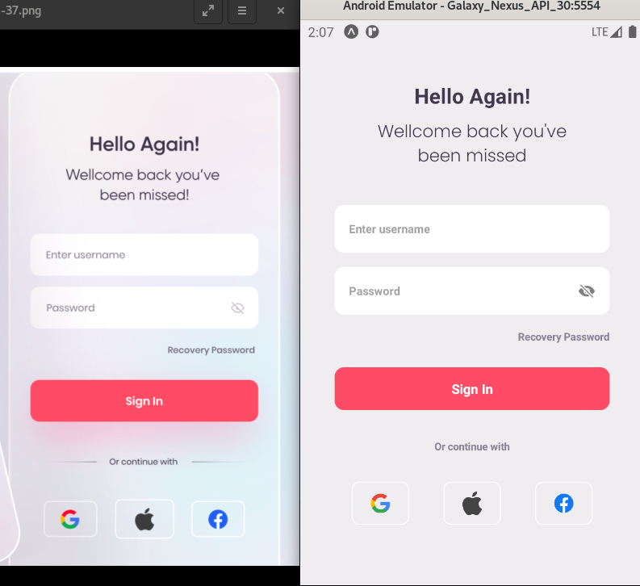

<h2  align="center">
React Native Login - Simples
</h2>

  

Aplicativo em React Native utilizando expo desenvolvido com os conceitos básicos de Clean Architecture. O App possui apenas a interface de login com um caso de uso `(RemoteLogin)` que foi implementado com base no livro Clean Architecture do autor  `Roberto C. Martin`, famoso `Uncle Bob`. 

Com a aplicação de uma arquitetura limpa ganhamos `Independência de Framework`, `Facilidade nos Testes`, `Geração de código durável e manutenível` dentre outros benefícios e em conjunto com os conceitos do `Solid` ganhamos qualidade na entrega e um código limpo e organizado. 

<h3>Princípios utilizados</h3>

* <b>S</b>ingle Responsibility
* <b>O</b>pen Closed
* <b>L</b>iskov Substitution
* <b>I</b>nterface Segregation
* <b>D</b>ependency Inversion
* Separation of Concerns
* Don't Repeat Yourself
* Keep It Simple
* Small Commits

<h3>Bibliotecas e ferramentas</h3>

* React Native 
* Expo
* NodeJS 18
* Typescript
* Axios
* Jest
* Git
